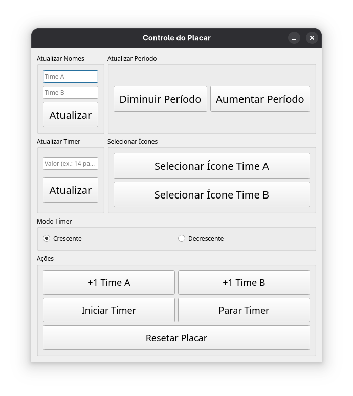
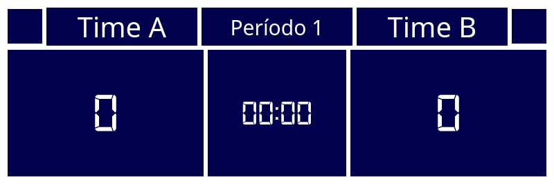

# Placar Interativo 🎮🏀

  


## Linguagens e Tecnologias 🛠️
- **Python 🐍**: Lógica principal do projeto.
- **PyQt5 🖼️**: Interface gráfica para as janelas do placar e controle.
- **Sockets (TCP) 🔌**: Comunicação entre a interface de controle e o placar.

## Arquivos 📂
- **placar.py**: Exibe o placar interativo com timer, nomes e pontuações.
- **controle.py**: Interface para atualizar nomes, período, timer, selecionar ícones e executar ações rápidas.

## Como Usar 🚀

Para iniciar o projeto, basta rodar o arquivo `main.py`:
```bash
python main.py
```

## Observações 📌
- As atualizações enviadas pelo controle são recebidas pelo placar via socket TCP 📡.
- No modo decrescente, o timer decrementa até chegar a zero, onde ele para automaticamente 🛑.
- As janelas são configuradas para serem leves e integradas ao ambiente de streaming, possibilitando uma personalização fácil 🎨.

Sinta-se à vontade para ajustar as configurações e personalizar o projeto conforme suas necessidades. Divirta-se! 😄🎉
